# 🛒 Single Vendor E-commerce Website

A simple and responsive **Single Vendor E-commerce Website** built with **Django, HTML, CSS, JavaScript, Bootstrap, and SQLite**.

This project was developed as a Django assignment to practice **Django models, views, templates, URL routing, forms, database operations, sessions, and Django Admin**.

---

## 📌 Project Overview

The website allows customers to:

**View Products → View Details → Add to Cart → Manage Cart → Checkout → Place Order**

Products are dynamically loaded from the Django database and can be managed through the **Django Admin Panel**.

---

## ✨ Features

### 🏠 Home Page

* Shop name/logo
* Responsive navigation bar
* Bootstrap banner
* Product categories
* Featured products
* Footer

### 🛍️ Product Page

* Display products from the database
* Product image
* Product name
* Price
* Short description
* View Details button
* Add to Cart button

### 📦 Product Details

* Product image
* Product name
* Price
* Full description
* Available quantity
* Add to Cart

### 🛒 Shopping Cart

* Add products to cart
* Increase quantity
* Decrease quantity
* Remove products
* Display total price
* Quantity validation based on available stock

### 💳 Checkout

* Customer name
* Phone number
* Address
* Order placement
* Order information saved to database

### ✅ Order Success

After successfully placing an order, customers see:

> **Order Placed Successfully!**

### ⚙️ Django Admin

Products can be:

* Added
* Updated
* Deleted
* Managed

directly through the Django Admin Panel.

---

## 🎯 Bonus Features

The project can be extended with additional features such as:

* 🔍 Product Search
* 🗂️ Category Filter
* 👤 Login/Register
* 🏷️ Product Discount
* ⭐ Product Rating
* 📋 Order History

---

## 🛠️ Technologies Used

| Technology   | Purpose                   |
| ------------ | ------------------------- |
| Python       | Backend programming       |
| Django       | Web framework             |
| SQLite       | Database                  |
| HTML5        | Website structure         |
| CSS3         | Custom styling            |
| JavaScript   | Client-side functionality |
| Bootstrap    | Responsive UI             |
| Git & GitHub | Version control           |

---

## 📂 Project Structure

```text
single-vendor-ecommerce/
│
├── manage.py
├── requirements.txt
├── README.md
├── .gitignore
│
├── ecommerce/
│   ├── __init__.py
│   ├── settings.py
│   ├── urls.py
│   ├── asgi.py
│   └── wsgi.py
│
├── store/
│   ├── migrations/
│   ├── templates/
│   │   └── store/
│   │       ├── home.html
│   │       ├── products.html
│   │       ├── product_detail.html
│   │       ├── cart.html
│   │       ├── checkout.html
│   │       └── order_success.html
│   │
│   ├── static/
│   │   └── store/
│   │       ├── css/
│   │       │   └── style.css
│   │       └── js/
│   │           └── script.js
│   │
│   ├── admin.py
│   ├── apps.py
│   ├── forms.py
│   ├── models.py
│   ├── urls.py
│   └── views.py
│
└── media/
    └── products/
```

> **Note:** The exact project structure may vary depending on the implementation.

---

## 🗄️ Database Models

The project uses Django models for managing products, customers, and orders.

### Product

| Field        | Description         |
| ------------ | ------------------- |
| Product Name | Name of the product |
| Price        | Product price       |
| Description  | Product description |
| Image        | Product image       |
| Quantity     | Available stock     |

### Customer

| Field   | Description           |
| ------- | --------------------- |
| Name    | Customer name         |
| Phone   | Customer phone number |
| Address | Customer address      |

### Order

| Field       | Description                   |
| ----------- | ----------------------------- |
| Customer    | Customer who placed the order |
| Product     | Ordered product               |
| Quantity    | Ordered quantity              |
| Total Price | Total order price             |
| Order Date  | Date and time of order        |

---

## 🚀 Installation & Setup

### 1. Clone the Repository

```bash
https://github.com/yeaminhossainfuhad-cloud/single-vendor-ecommerce
```

### 2. Go to the Project Directory

```bash
cd single-vendor-ecommerce
```

### 3. Create a Virtual Environment

```bash
python -m venv .venv
```

### 4. Activate Virtual Environment

#### Windows

```bash
.venv\Scripts\activate
```

#### macOS/Linux

```bash
source .venv/bin/activate
```

### 5. Install Dependencies

```bash
pip install -r requirements.txt
```

### 6. Apply Migrations

```bash
python manage.py makemigrations
python manage.py migrate
```

### 7. Create a Superuser

```bash
python manage.py createsuperuser
```

Enter your:

* Username
* Email
* Password

when prompted.

### 8. Run the Development Server

```bash
python manage.py runserver
```

### 9. Open the Website

Visit:

```text
http://127.0.0.1:8000/
```

### 10. Open Django Admin

Visit:

```text
http://127.0.0.1:8000/admin/
```

Log in using the superuser credentials and add/manage products.

---

## 🔄 User Flow

```text
                ┌─────────────┐
                │    Home     │
                └──────┬──────┘
                       ↓
                ┌─────────────┐
                │  Products   │
                └──────┬──────┘
                       ↓
              ┌──────────────────┐
              │ Product Details  │
              └────────┬─────────┘
                       ↓
                ┌─────────────┐
                │ Add to Cart │
                └──────┬──────┘
                       ↓
                ┌─────────────┐
                │    Cart     │
                └──────┬──────┘
                       ↓
                ┌─────────────┐
                │   Checkout  │
                └──────┬──────┘
                       ↓
                ┌─────────────┐
                │ Place Order │
                └──────┬──────┘
                       ↓
              ┌──────────────────┐
              │  Order Success   │
              └──────────────────┘
```

---

## 🛒 Cart Functionality

The shopping cart allows users to manage selected products before checkout.

Users can:

```text
Add Product
     ↓
Increase Quantity
     ↓
Decrease Quantity
     ↓
Remove Product
     ↓
Calculate Total
     ↓
Proceed to Checkout
```

JavaScript is used for client-side interactions such as quantity controls and total-price updates where applicable.

---

## 📱 Responsive Design

The website uses **Bootstrap's responsive grid system and components** to provide a user-friendly experience across:

* 💻 Desktop
* 💻 Laptop
* 📱 Tablet
* 📱 Mobile

Bootstrap is used for:

* Navbar
* Cards
* Buttons
* Forms
* Grid system
* Alerts
* Responsive layout

Custom CSS is also used to improve the appearance of the website.

---

## 🔐 Django Admin

The Django Admin Panel provides an easy way for the shop owner/admin to manage products.

Admin can:

```text
Login
  ↓
Manage Products
  ├── Add Product
  ├── Edit Product
  ├── Delete Product
  └── Update Stock
```

---

## 📋 Assignment Requirements Covered

| Requirement             | Status |
| ----------------------- | ------ |
| Django Project          | ✅      |
| Django Models           | ✅      |
| Django Views            | ✅      |
| URL Routing             | ✅      |
| Django Templates        | ✅      |
| Django Forms            | ✅      |
| SQLite Database         | ✅      |
| Django Admin            | ✅      |
| Product Management      | ✅      |
| Product Details         | ✅      |
| Add to Cart             | ✅      |
| Update Cart Quantity    | ✅      |
| Remove from Cart        | ✅      |
| Total Price Calculation | ✅      |
| Checkout Form           | ✅      |
| Save Order to Database  | ✅      |
| Order Success Page      | ✅      |
| Bootstrap               | ✅      |
| Custom CSS              | ✅      |
| JavaScript              | ✅      |
| Responsive Design       | ✅      |

---

## 📦 Requirements

The project requires Python and Django.

Example `requirements.txt`:

```text
Django>=5.0
Pillow
```

> The exact versions should match the packages used in the project.

---

## 🧹 GitHub `.gitignore`

The following files/folders should not be uploaded to GitHub:

```text
.venv/
__pycache__/
*.pyc
db.sqlite3
.env
media/
```

> If your assignment requires the SQLite database or product images to be submitted, adjust `.gitignore` accordingly.

---

## 📸 Project Screenshots

### 🏠 Home Page
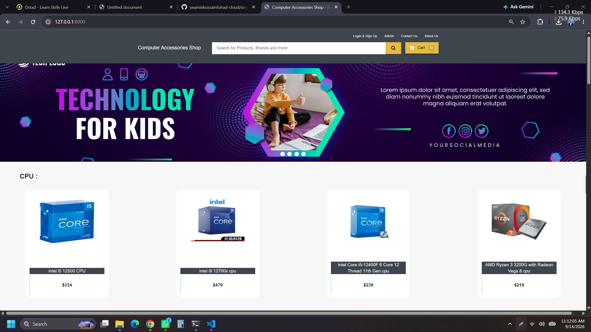

### 🛍️ Product View
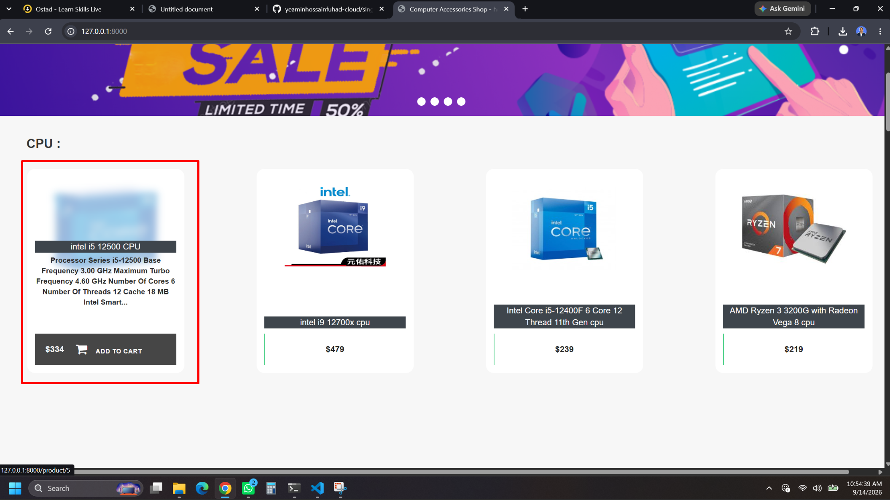

### 📦 Product Details
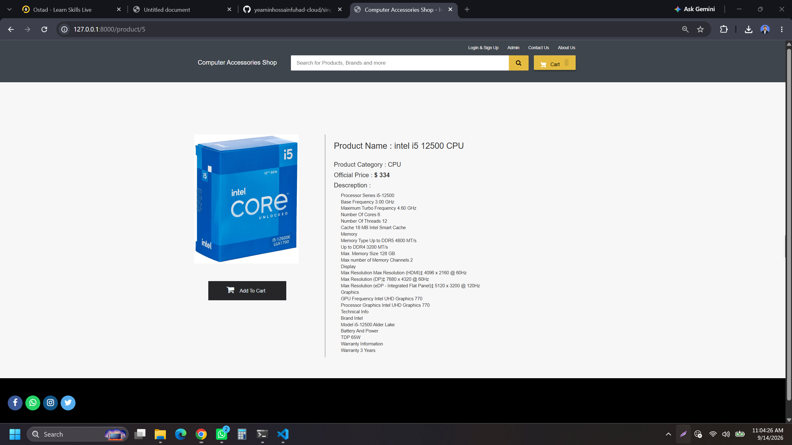

### ➕ Add Product
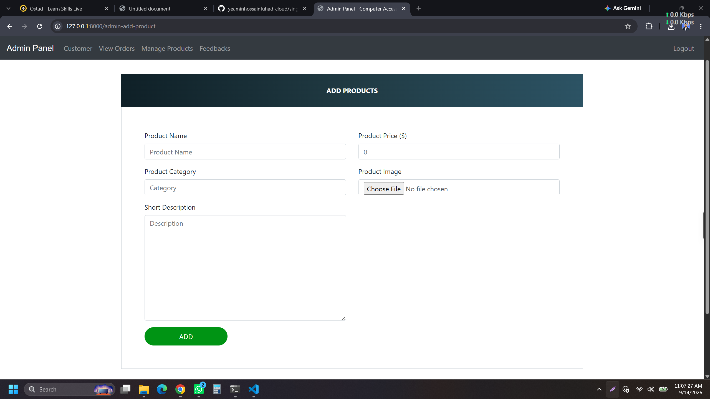

### 🛒 Shopping Cart
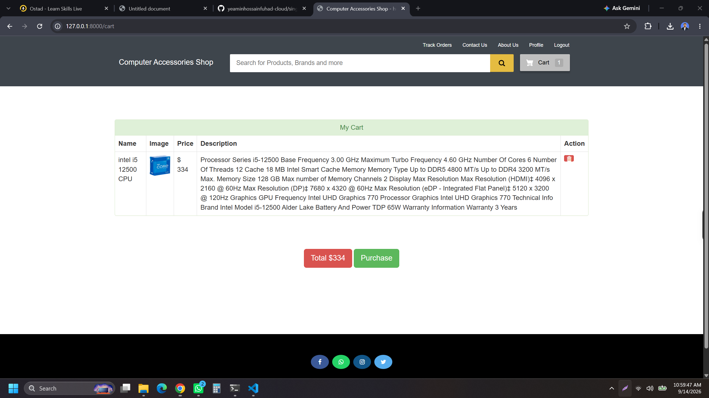

### 💳 Checkout
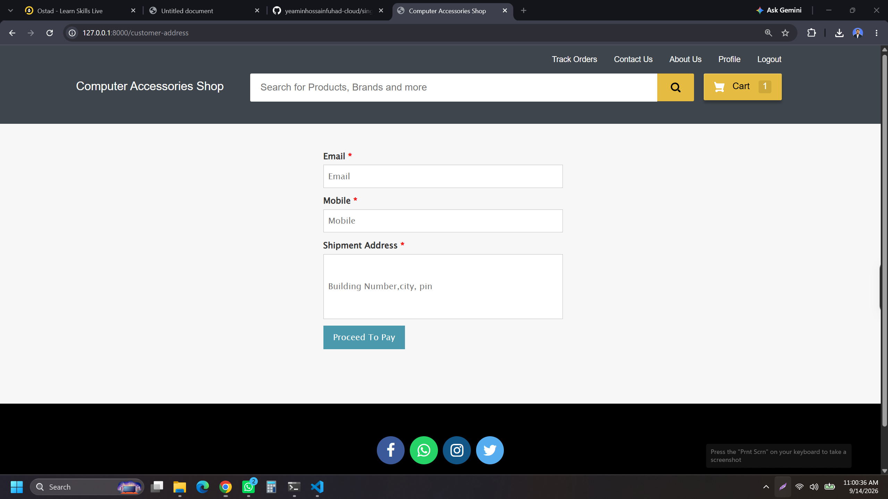

### 💰 Payment
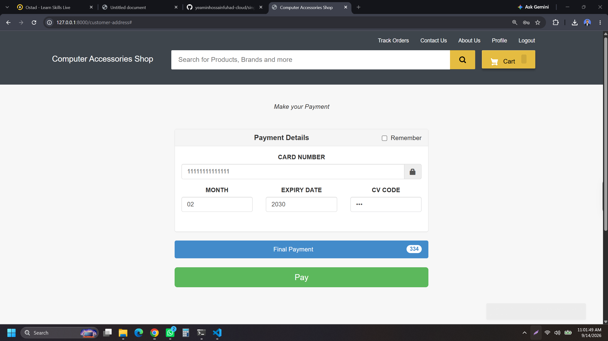

### 📦 Place Order
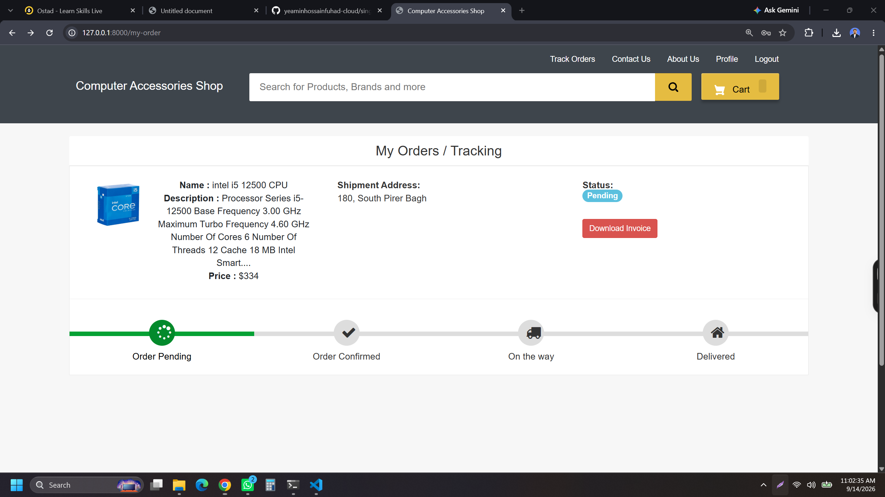

### 🔐 Login
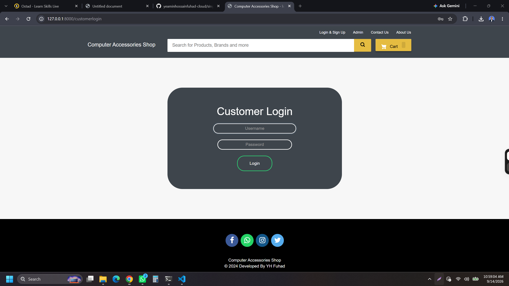

### 📝 Sign Up
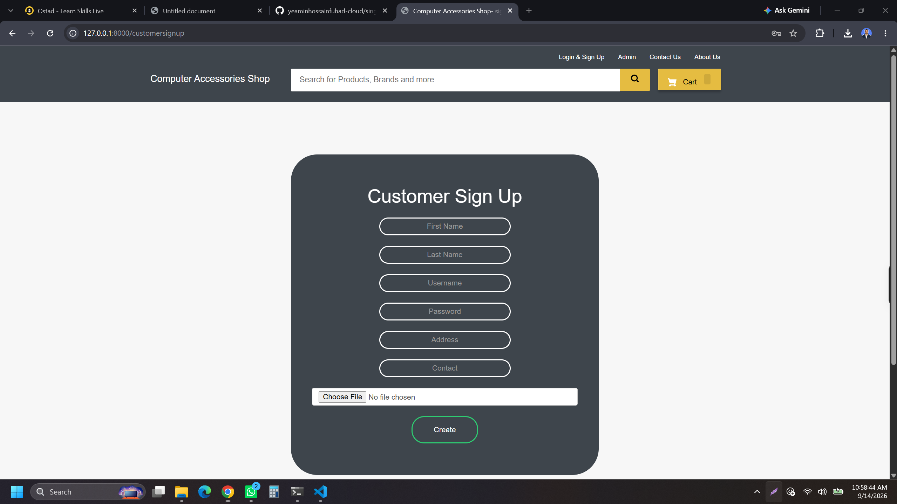

### ⚙️ Admin Login
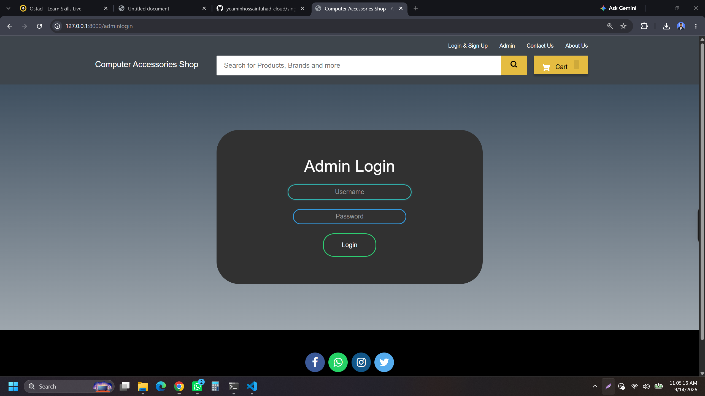

### 📊 Admin Dashboard
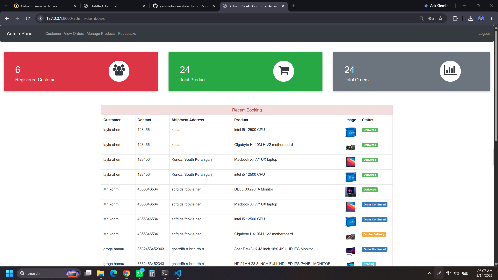

### 🛠️ Manage Product
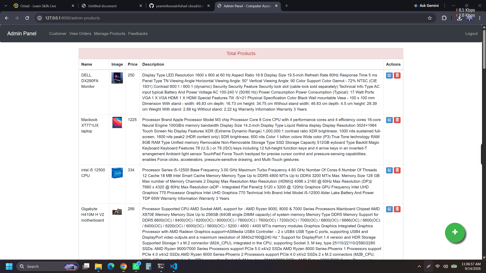


## 🎓 Learning Objectives

Through this project, the following Django concepts are practiced:

* Django Project & App Structure
* Models
* Migrations
* Django ORM
* Views
* URL Routing
* Templates
* Template Inheritance
* Forms
* POST Requests
* Session-based Cart
* Database Operations
* Django Admin
* Static Files
* Media Files
* Bootstrap Integration
* JavaScript Integration
* Git & GitHub

---

## 👨‍💻 Author

**Md Yeamin Hossain Fuhad**

Diploma in Computer Science & Technology
B.Sc. in Computer Science & Engineering (CSE)

### Skills

* Python
* Django
* HTML
* CSS
* JavaScript
* Bootstrap
* SQL
* Git & GitHub

---

## 📄 License

This project was created for educational and academic purposes.
